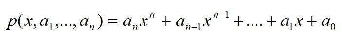
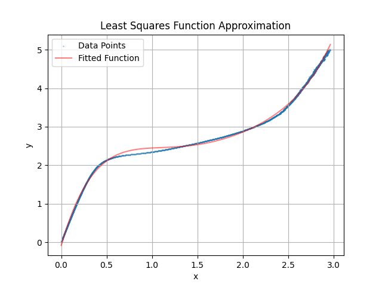

# Least squares
Implementation of the least squares method for constructing an approximating polynomial

The method consists in obtaining coefficients of a polynomial of the `n`-th degree for the given points of the graph of some function `f(x,y)` in the Cartesian coordinate system, such that this polynomial is an approximating function for `f(x,y)`     

polynomial of n-th degree:

## Input data
At the entrance to the program, an Excel file is submitted with a set of points (x, y) of the original graph of the function that needs to be approximated. And also the degree of the approximating polynomial (in code variable `degree`)   

## Output data
At the output we get n+1 coefficients of the approximating polynomial `a0, a1,..., an`. Also, as a result of the calculation, a graph of the original function is plotted (using points from the Excel file - blue line) and an approximating function (red line)     

Example output: approximation of a polynomial at n=5:
